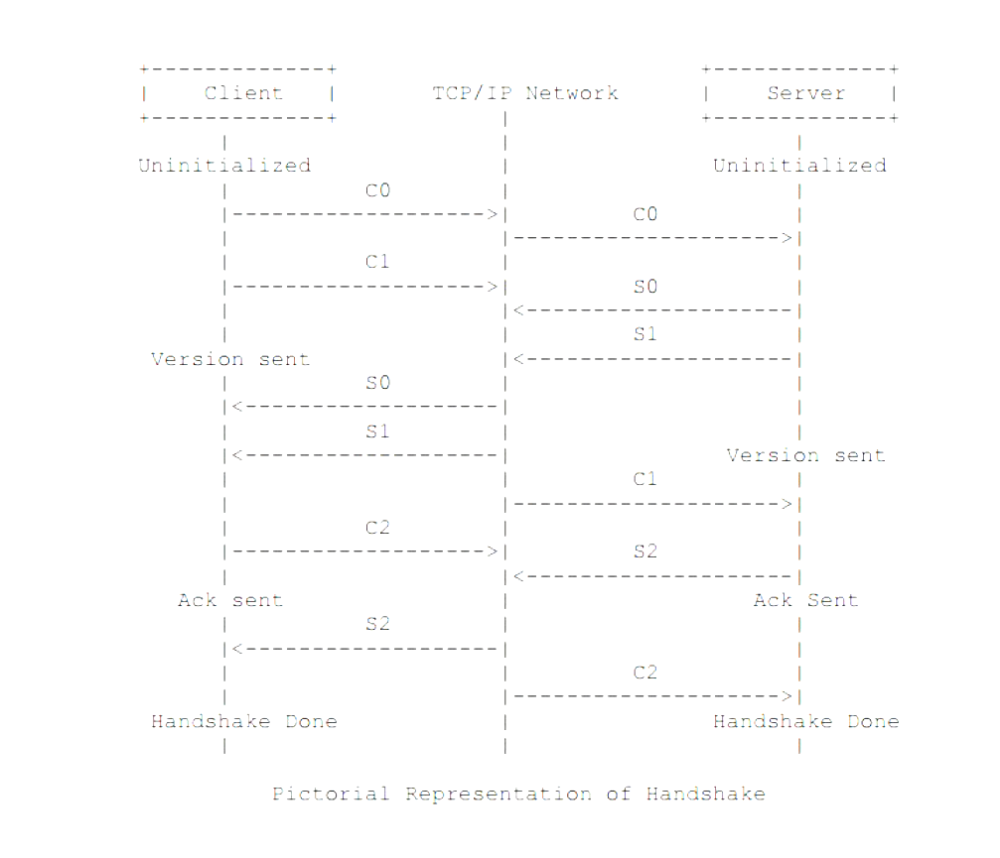

# RTMP (Real-Time Messaging Protocol) 协议详解

RTMP 是由 Adobe 公司设计的基于 TCP 的流媒体协议。理解 RTMP 的关键在于将其视为一个**有状态的、多路复用的、二进制块传输协议**。

---

## 1. 核心设计理念：分块 (Chunking)

在流媒体传输中，大的视频关键帧（I 帧）可能达到几百 KB。如果直接发送，会长时间占用 TCP 通道，导致音频包和控制命令被阻塞，产生明显的音画不同步或控制延迟。

**RTMP 的解决方案：**
- **切片传输**：将所有数据（音视频、命令）切分成固定大小的块（Chunk，默认 128 字节）。
- **优先级交织**：在发送一个大视频帧的过程中，可以随时插播音频 Chunk 或控制命令 Chunk。
- **重组**：接收端根据 Chunk Header 中的 `Stream ID` 将碎片重新组装成完整的 Message。

---

## 2. 第一阶段：二进制握手 (Handshake)

RTMP 在 TCP 连接建立后，必须进行三轮二进制握手（C0/C1/C2 与 S0/S1/S2），以确认协议版本和同步时间戳。

1. **C0/S0 (1 byte)**：告知 RTMP 版本号（通常为 `0x03`）。
2. **C1/S1 (1536 bytes)**：发送各方的系统时间戳和随机噪声数据。
3. **C2/S2 (1536 bytes)**：**回声测试**。将对方发送的 C1/S1 原封不动发回，用于计算网络往返时延 (RTT)。

---

## 3. 第二阶段：分块格式 (Chunk Format)

每一个 RTMP 数据包（Chunk）由三部分组成：**Basic Header + Message Header + Payload**。

### 3.1 Basic Header (1-3 bytes)
决定了这个包裹的基本属性，包含两个核心字段：
- **fmt (2 bits)**：决定了接下来的 `Message Header` 有多长。
- **CSID (6 bits)**：块流 ID，用于区分逻辑通道（如控制消息、音视频流）。

### 3.2 Message Header (0, 3, 7, 11 bytes)
长度由 `fmt` 决定：
- **Type 0 (11 bytes)**：全量头部（绝对时间戳、长度、类型 ID、流 ID）。**每个 Message 的第一个 Chunk 必须是 Type 0。**
- **Type 1 (7 bytes)**：省略 Stream ID。适用于同一条流的后续消息。
- **Type 2 (3 bytes)**：仅包含时间戳增量。
- **Type 3 (0 bytes)**：完全复用前一个 Chunk 的头部信息。

### 3.3 Message Type ID (常用类型)
- **1, 2, 3, 5, 6**：协议控制消息（设置块大小、确认窗口等）。
- **4**：用户控制消息（Stream Begin/IsRecorded）。
- **8, 9**：音频 / 视频数据。
- **18 (0x12)**：AMF0 数据消息（Metadata / @setDataFrame）。
- **20 (0x14)**：AMF0 命令消息（connect, publish, play 等）。

---

## 4. 第三阶段：业务交互流程 (AMF0 命令)

RTMP 使用 **AMF0 (Action Message Format)** 这种二进制 JSON 格式进行逻辑交互。

### 4.1 通用连接流程 (Connect)
1. 客户端发送 `connect("app_name")`。

2. 服务端回复 `Window Acknowledgement Size`、`Set Peer Bandwidth`、`Set Chunk Size`。

3. 服务端回复 `_result("NetConnection.Connect.Success")`。

### 4.2 推流流程 (Publish)
1. 客户端发送 `createStream()` -> 服务端返回 `streamId`。
2. 客户端发送 `publish("stream_name")`。
3. 服务端回复 `onStatus("NetStream.Publish.Start")`。
4. 客户端发送 `@setDataFrame(metadata)`：包含分辨率、帧率、编码器参数等。
5. 客户端开始发送音视频数据。

### 4.3 拉流流程 (Play)

1. 客户端发送 `createStream()`。

2. 客户端发送 `play("stream_name")`。

3. 服务端回复 `User Control (StreamBegin)` 和 `onStatus("NetStream.Play.Start")`。

4. 服务端开始下发音视频数据。

---

## 5. 服务端实现的关键细节

1. **协议嗅探**：
   - 监听 1935 端口。
   - 读取第一个字节，如果是 `0x03`，则进入 RTMP 握手流程。
2. **秒开 (GOP 缓存)**：
   - 当收到推流端的 `metadata`、`SPS/PPS` (Video Sequence Header) 时必须缓存。
   - 当新观众加入时，立即下发缓存的配置信息和最近的一个 I 帧 GOP，实现即时画面呈现。
3. **Chunk Size 优化**：
   - 默认 128 字节解析开销大。建议在连接成功后通过 `Set Chunk Size` 将其提升至 **4096 字节**，显著降低 CPU 解析负担。
